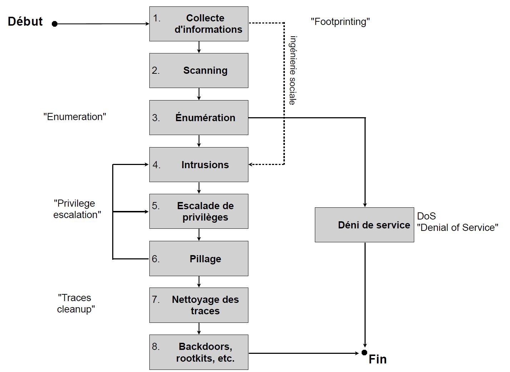

# Resumé TE1 ISI (recto)

## chapitre 1
phreaking = ancien type de piratage (sur rsx téléphonique)

## chapitre 2 - Introduction
Conséquences de la sécurité (perte) :
- financière
- réputation
- image de marque
- avantage compétitif
- temps
Exemple :
- Perte de données
- Fuite de données

Risques :
- Cyber attacks
- Activités criminel
- Degâts naturels
- Terrorisme

## chapitre 3 - Insecurité des systèmes
une **menace** peut exploiter une **vulnerabilité** en causant des **dommages** ce qui crée un **incident** il faut donc étudier et surveiller les **vulnérabilités**
### Types de menaces
#### Menaces accidentelles (erreurs) :
- Mauvaises manipulations : déclassification ou destruction accidentelle d'une information, perte d'un laptop, etc.
- Négligence, incompétence, fatigue, stress...
#### Menaces environnementales :
- d'origine naturelle : tremblements de terre, cyclones, avalanches, foudre, inondations, etc... (typique de zones géographiques)
- d'origine industrielle : industries chimiques (corrosion, pollution), chantiers, émissions radioélectriques
parasites, etc.
#### Menaces délibérées (intentionnelles) :
- d’origine criminelle : les risques relatifs dépendent alors des compétences, des types d’intention et des
motivations de l'agresseur.
### Types de vulnerabilites
#### Matériel
- maintenance insuffisante des équipements de stockage (disques saturés/morts, sans alerte).
#### Logiciel
- Sondage (CMU) : en moyenne il y a 20-30 bugs/failles par 1000 lignes de codes...
- Exploitation / utilisation : cas WEF (oubli ? incompétences ?)
#### Réseau
- trafic sensible non protégé, accès Wifi ouverts, etc.
#### Personnel (RH)
- absence, manque de formation, faute, contournement de procédure, etc.
#### Site (physique)
- alimentation électrique instable, antivols, etc.
#### Organisation
- procédure d'enregistrement / d'accréditation d'un utilisateur, etc.

### Attaquants
- black, grey, white hat (méchant, dépend de l'envie, gentil)

#### Motivations
- S'amuser, souvent sans autre but
- Curiosité
- Prise de contrôle, pouvoir, ego
- Acquérir des connaissances techniques
- Morales : politique, écologie, social, «robin des bois», etc.
- Ressources gratuites : accès, machines, etc.
- Argent, escroqueries, espionnage industriel/économique
- Terrorisme, espionnage, guerre informatique
- (Apprentissage, tests d’intrusions, améliorations sécuritaires, etc.)

#### Compétences
80% "script kiddies", 15% "Eduqués" et 5% Experts

#### Demarche intrusions

## chapitre 4 - Collecte d'informa:ons
## chapitre 5 - Scanning et énumération
## chapitre 6 - Intrusions de systèmes
## chapitre 7 - Spams
## chapitre 8 - E-mails forgés
## chapitre 9 - Codes malveillants
## chapitre 10 - Attaques réseaux
## chapitre 11 - Attaques Web
## chapitre 12 - Escalade de privilèges, pillage, nettoyage des traces
## chapitre 13 - Dénis de service
Objectif : Nuire à la disponibilité d'un système d'information
Exemples de techniques connues :
- «SYN flooding»
    - bcp de paquets SYN pour surcharger la RAM (contré par timeout plus court ou limiter les connexions en suspens)
- Smurf
    - bcp de ping indirect sur adresses broadcast (contré par filtrer ping en broadcast)
- Déni de service distribué (DDoS)
    - utiliser des machines esclaves (plusieurs esclaves/maitres = botnet)

Protextion DoS
- défense au niveau du FAI / ISP (FAI : fournisseur d’accès Internet)
- éviter les vulnérabilités des systèmes (OS, applications, ...)
- filtrage au niveau des pare-feux et routeurs (utilisation de seuils...)
- redondance des équipements